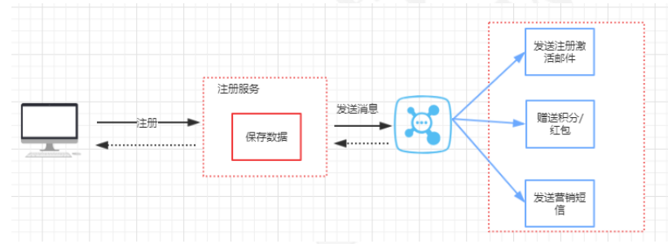
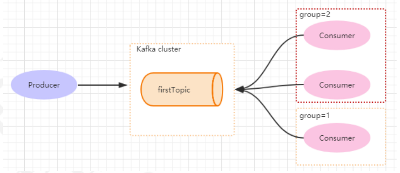
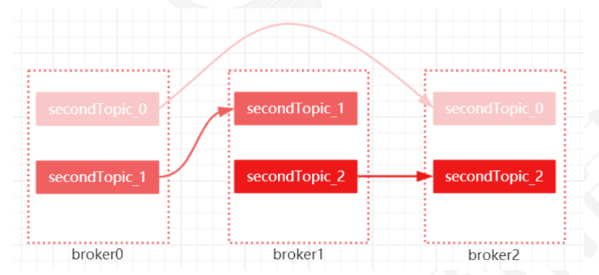

# kafka

消息中间件的应用场景：先说一下消息队列的常见使用场景吧，其实场景有很多，但是比较核心的有3个：解耦、异步、削峰。举个非常简单的例子，就拿一个电商平台的注册功能来简单分析下，用
户注册这一个服务，不单单只是insert一条数据到数据库里面就完事了，还需要发送激活邮件、发送新
人红包或者积分、发送营销短信等一系列操作。假如说这里面的每一个操作，都需要消耗1s，那么整个
注册过程就需要耗时4s才能响应给用户。所以我们可以对这些子操作进行来实现异
步化执行，类似于多线程并行处理的概念。这个是分布式消息队列的第一个解决场景【异步处理】

kafka的特点其实很明显，就是仅仅提供较少的核心功能，但是提供超高的吞吐量，ms级的延迟，极高的可用性以及可靠性，而且分布式可以任意扩展
同时kafka最好是支撑较少的topic数量即可，保证其超高吞吐量。

## 基础配置分析
### group.id

consumer group是kafka提供的可扩展且具有容错性的消费者机制。既然是一个组，那么组内必然可以
有多个消费者或消费者实例(consumer instance)，它们共享一个公共的ID，即group ID。组内的所有
消费者协调在一起来消费订阅主题(subscribed topics)的所有分区(partition)。当然，每个分区只能由
同一个消费组内的一个consumer来消费.

 
### enable.auto.commit
消费者消费消息以后自动提交，只有当消息提交以后，该消息才不会被再次接收到，还可以配合auto.commit.interval.ms控制自动提交的频率。
当然，我们也可以通过consumer.commitSync()的方式实现手动提交

### auto.offset.reset
这个参数是针对新的groupid中的消费者而言的，当有新groupid的消费者来消费指定的topic时，对于该参数的配置，会有不同的语义。
auto.offset.reset=latest情况下，新的消费者将会从其他消费者最后消费的offset处开始消费Topic下的消息。
auto.offset.reset= earliest情况下，新的消费者会从该topic最早的消息开始消费。
auto.offset.reset=none情况下，新的消费者加入以后，由于之前不存在offset，则会直接抛出异常。

### max.poll.records
此设置限制每次调用poll返回的消息数，这样可以更容易的预测每次poll间隔要处理的最大值。通过调整此值，可以减少poll间隔

## 关于Topic和Partition
Broker：Kafka集群中的每一台服务器。Kafka是一个分布式集群，我们将其中每一台服务器都叫做Broker。

topic: 主题，它代表着消息的类别。发布者发布一条消息必须指定topic，订阅者通过订阅topic就能消费此消息。每个topic可以有多个生产者向它发送消息，也可以有多个消费者去消费其中的消息。

Partition: 每个topic可以划分多个分区（每个Topic至少有一个分区），同一topic下的不同分区包含的消息是不同
的。每个消息在被添加到分区时，都会被分配一个offset（称之为偏移量），它是消息在此分区中的唯
一编号，kafka通过offset保证消息在分区内的顺序，offset的顺序不跨分区，即kafka只保证在同一个
分区内的消息是有序的。

Partition是以文件的形式存储在文件系统中，比如创建一个名为firstTopic的topic，其中有3个
partition，那么在kafka的数据目录（/tmp/kafka-log）中就有3个目录，firstTopic-0~3， 命名规则是
<topic_name>-<partition_id>

## 消息分发机制
默认情况下，kafka采用的是hash取模的分区算法。如果Key为null，则会随机分配一个分区。这个随机
是在这个参数”metadata.max.age.ms”的时间范围内随机选择一个。对于这个时间段内，如果key为
null，则只会发送到唯一的分区。这个值默认情况下是10分钟更新一次。

	//消费指定的分区 
	TopicPartition topicPartition=new TopicPartition(topic,0); 
	kafkaConsumer.assign(Arrays.asList(topicPartition));

## 消息消费原理
在实际生产过程中，每个topic都会有多个partitions，多个partitions的好处在于，一方面能够对
broker上的数据进行分片有效减少了消息的容量从而提升io性能。另外一方面，为了提高消费端的消费
能力，一般会通过多个consumer去消费同一个topic ，也就是消费端的负载均衡机制。

举例：

- 如果3个partiton对应3个consumer，那么结果就是consumer1会消费partition0分区、consumer2会消费partition1分区、consumer3会消费 partition2分区。

- 如果3个partiton对应2个consumer，那么结果就是consumer1会消费partition0/partition1分区、consumer2会消费partition2分区。

- 如果3个partition对应4个或以上consumer，仍然只有3个consumer对应3个partition，其他的consumer无法消费消息。

### consumer和partition的数量建议
1. 如果consumer比partition多，是浪费，因为kafka的设计是在一个partition上是不允许并发的，
所以consumer数不要大于partition数 2. 如果consumer比partition少，一个consumer会对应于多个partitions，这里主要合理分配
consumer数和partition数，否则会导致partition里面的数据被取的不均匀。最好partiton数目是
consumer数目的整数倍，所以partition数目很重要，比如取24，就很容易设定consumer数目
3. 如果consumer从多个partition读到数据，不保证数据间的顺序性，kafka只保证在一个partition
上数据是有序的，但多个partition，根据你读的顺序会有不同
4. 增减consumer，broker，partition会导致rebalance，所以rebalance后consumer对应的
partition会发生变化

## 分区分配策略
在kafka中，存在三种分区分配策略，一种是Range(默认)、 另一种是RoundRobin（轮询）、
StickyAssignor(粘性)。 在消费端中的ConsumerConfig中，通过这个属性来指定分区分配策略

	public static final String PARTITION_ASSIGNMENT_STRATEGY_CONFIG = "partition.assignment.strategy";

- Range: 范围分区。Range策略是对每个主题而言的，首先对同一个主题里面的分区按照序号进行排序，并对消费者按照字
母顺序进行排序。假设我们有10个分区，3个消费者。那么分区结果就是：C1-0 将消费 0, 1, 2, 3 分区
C2-0 将消费 4, 5, 6 分区
C3-0 将消费 7, 8, 9 分区
- RoundRobin： 轮询分区。轮询分区策略是把所有partition和所有consumer线程都列出来，然后按照hashcode进行排序。最后通
过轮询算法分配partition给消费线程。如果所有consumer实例的订阅是相同的，那么partition会均匀分布。使用轮询分区策略必须满足两个条件
： 一个是每个主题的消费者实例具有相同数量的流, 另一个是每个消费者订阅的主题必须是相同的。
- Stricky：分区的分配尽可能的均匀，分区的分配尽可能和上次分配保持相同

## 如何保存消费端的消费位置
每个消息在被添加到分区时，都会被分配一个
offset（称之为偏移量），它是消息在此分区中的唯一编号，kafka通过offset保证消息在分区内的顺
序，offset的顺序不跨分区，即kafka只保证在同一个分区内的消息是有序的； 对于应用层的消费来
说，每次消费一个消息并且提交以后，会保存当前消费到的最近的一个offset。

在kafka中，提供了一个consumer_offsets_* 的一个topic，把offset信息写入到这个topic中。
consumer_offsets——按保存了每个consumer group某一时刻提交的offset信息。
__consumer_offsets 默认有50个分区。

计算公式：

	Math.abs(“groupid”.hashCode())%groupMetadataTopicPartitionCount ;

由于默认情况下
groupMetadataTopicPartitionCount有50个分区，如果计算得到的结果为:35, 那么就意味着当前的
consumer_group的位移信息保存在__consumer_offsets的第35个分区。

## 分区的副本和选举机制
Kafka提供了一个角色：
coordinator来执行对于consumer group的管理，当consumer group的第一个consumer启动的时
候，它会去和kafka server确定谁是它们组的coordinator。之后该group内的所有成员都会和该coordinator进行协调通信。消费者向kafka集群中的任意一个broker发送一个
GroupCoordinatorRequest请求，服务端会返回一个负载最小的broker节点的id，并将该broker设置为coordinator。

每个分区可以有多个副本，并且在副本集合中会存在一个leader的副本，所有的读写请求都是由leader
副本来进行处理。剩余的其他副本都做为follower副本，follower副本会从leader副本同步消息日志。kafka集群中的一个broker中最多只能有一个副本，leader副本所在的broker节点的
分区叫leader节点，follower副本所在的broker节点的分区叫follower节点。

### kafka的leader选举机制
kafka是基于Raft选举算法来实现leader选举的。

Kafka分区下有可能有很多个副本(replica)用于实现冗余，从而进一步实现高可用。副本根据角色的不同
可分为3类：
leader副本：响应clients端读写请求的副本
follower副本：被动地备份leader副本中的数据，不能响应clients端读写请求。
ISR副本：包含了leader副本和所有与leader副本保持同步的follower副本——如何判定是否与leader同
步后面会提到每个Kafka副本对象都有两个重要的属性：LEO和HW。注意是所有的副本，而不只是leader副本。从生产者发出的 一 条消息首先会被写入分区的leader 副本，不过还需要等待ISR集合中的所有
follower副本都同步完之后才能被认为已经提交，之后才会更新分区的HW, 进而消费者可以消费
到这条消息。

写请求首先由Leader副本处理，之后follower副本会从leader上拉取写入的消息，这个过程会有一定的
延迟，导致follower副本中保存的消息略少于leader副本，但是只要没有超出阈值都可以容忍。但是如
果一个follower副本出现异常，比如宕机、网络断开等原因长时间没有同步到消息，那这个时候，
leader就会把它踢出去。kafka通过ISR集合来维护一个分区副本信息。

一个新leader被选举并被接受客户端的消息成功写入。Kafka确保从同步副本列表中选举一个副本为
leader；leader负责维护和跟踪ISR(in-Sync replicas ， 副本同步队列)中所有follower滞后的状态。当
producer发送一条消息到broker后，leader写入消息并复制到所有follower。消息提交之后才被成功复
制到所有的同步副本。

